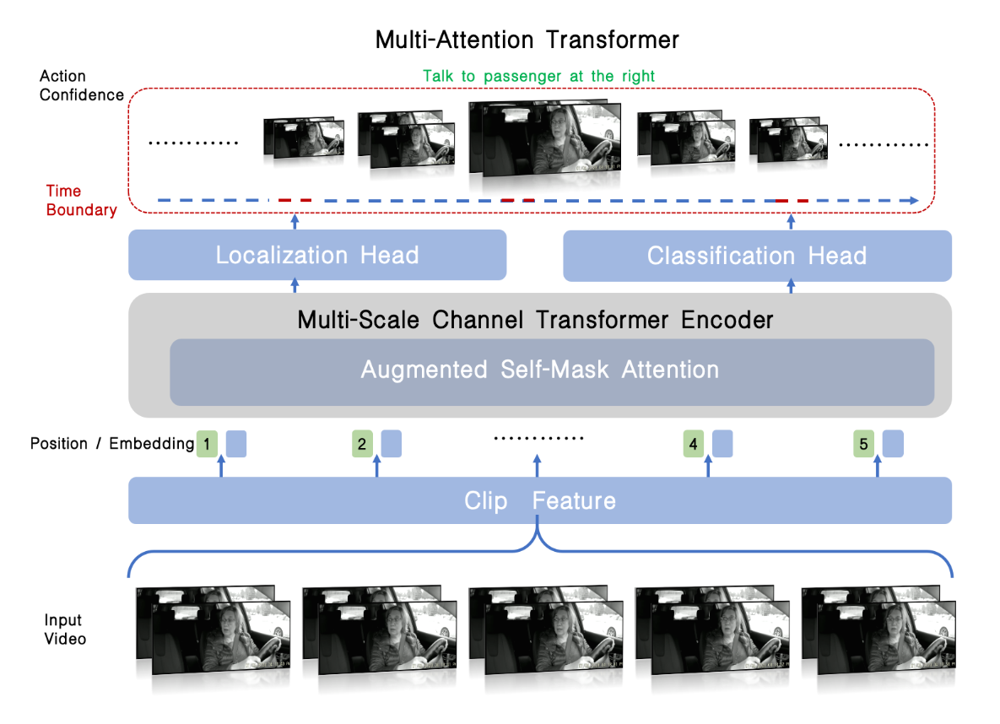

# Augmented Self-Mask Attention Transformer for Naturalistic Driving Action Recognition

The 1nd Place Submission to The 8th NVIDIA AI City Challenge (2024) Track 3: Naturalistic Driving Action Recognition.

<!--  -->

<div align=center>

</div>


## 
## To-Do
1. 上传videmaev2 pretrained weight (/data01/qtwang/VideoMAEv2-master/weights/vit_g_hybrid_pt_1200e_k710_ft.pth), 填到FEATURE_EXTRACTION.md
2. 上传videomaev2 finetune weight (/data01/qtwang/VideoMAEv2-master/workdir/track3_videomae_ego_verb/Crop_Mix_lr_1e-3_epoch_35/checkpoint-best/mp_rank_00_model_states.pt), 填到FEATURE_EXTRACTION.md和TEST.md
3. 上传A1&A2的video feats（/data01/qtwang/Aicity2023-Track3/data/extracted_features/v2_ego4d_verb_frame-16_sr-2）， 填到FEATURE_EXTRACTION.md
4. action detection 训练生成文件和Test.md中生成文件分开，和后处理要能对上，ckpt是否要生成文件放在固定目录下


## Data Structure
```
Aicity2024-track3/data
|--raw_videos/              # original videos
|   |--A1/                  
|       |--user_id_xxx/
|           |--xxx.MP4
|   |--A2/                  
|   |--labels&instructions/ 
|       |--A1/   
|           |--xxx.csv          
|--crop_videos/             # videos of crop human, structure like raw_videos
|   |--A1/
|       |--user_id_xxx/
|           |--xxx.mp4
|   |--A2/
|--splited_videos/          # videos splited by label
|   |--A1/
|       |--xxx.MP4
            ...
|       |--splited_videos_label.csv  
|--label_A1-train_A1-val.json
|--label_submit.json
```

## Workflow

The workflow for training action classification model is as follow:

1. [Dataset Preparation](docs/PREPROCESS.md)
2. [Feature Extraction](docs/FEATURE_EXTRACTION.md)
3. [Action Detection](docs/AMA.md)
4. [Time Correction](docs/POST_PROCESS.md)

## Example for Test on Dataset B
1. [Test Example](docs/TEST.md)


## Contact
If you have any questions, feel free to contact Tiantian Zhang ( zhangtt13@chinatelecom.cn / zhangtiantian_01@163.com ).
